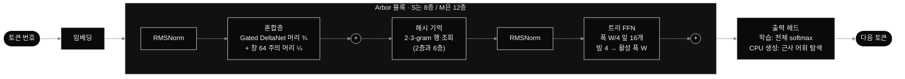

<div align="center">

<sub><a href="README.md">English</a> &nbsp;|&nbsp; <b>한국어</b></sub>


<br>

<a href="#-결과"></a>
<a href="#-결과"></a>
<a href="#-상태"></a>
<br>


<br><br>

### 작은 모델. 같은 계산량. 더 낮은 bpb.

작은 규모(**활성 파라미터 4,100만, 학습 6억 토큰, 같은 학습 FLOP, 시드 2개**)에서<br>
Arbor는 일반 트랜스포머보다 bpb가 **0.0875 낮았다**. 시드 간 차이의 **약 20배**다.

<br>

[**결과**](#-결과) &nbsp;·&nbsp; [**구조**](#-어떻게-동작하나) &nbsp;·&nbsp; [**왜 CPU인가**](#-왜-cpu에-맞췄나) &nbsp;·&nbsp; [**한계**](#-숫자를-믿기-전에-읽을-것) &nbsp;·&nbsp; [**실행**](#-실행) &nbsp;·&nbsp; [**이어서 하기**](#-이어서-할-사람에게)

</div>

<br>

## ■ 상태

> [!IMPORTANT]
> **중단했고, 다음 사람에게 넘긴다.** 구조 실험 결과는 진짜지만 범위가 좁다. 더 큰 규모에서 유지된다 해도, 활성 파라미터 1억 남짓이면 언어 능력은 GPT-2 small 언저리다. 원래 목표였던 "CPU만으로 도는 정말 쓸 만한 도우미"와는 거리가 멀다고 판단했다. 이어서 하는 데 필요한 것은 다 여기 있다. 모델 코드, 데이터 파이프라인, 테스트, 바로 돌릴 수 있는 다음 실험까지 있고, 라이선스는 MIT다.

<br>

## ■ 한눈에 보기

<table>
<tr>
<td align="center" width="33%"><h2>1.2320 → 1.1445</h2><sub>검증 bpb<br>트랜스포머 → Arbor</sub></td>
<td align="center" width="33%"><h2>−0.0875</h2><sub>같은 학습 FLOP에서의 bpb 차이<br>시드 간 차이의 약 20배</sub></td>
<td align="center" width="33%"><h2>4,100만</h2><sub>활성 파라미터<br>실행마다 6억 토큰</sub></td>
</tr>
<tr>
<td align="center"><h2>−0.006</h2><sub>주의층을 순환 혼합층으로 바꿔도<br>품질은 거의 그대로</sub></td>
<td align="center"><h2>−0.038 · −0.043</h2><sub>트리 FFN · 해시 n-gram 기억<br>향상은 거의 여기서 나왔다</sub></td>
<td align="center"><h2>약 8시간</h2><sub>H100 한 대 기준 총 계산량<br>데이터 + 파일럿 + 본 학습 10회</sub></td>
</tr>
</table>

<br>

## ■ 결과

<div align="center">

</div>

<br>

트랜스포머 위에 Arbor 부품을 하나씩 더해 가며 비교했다. 데이터 창, 학습률 탐색 예산, 시드 수(2개)는 모두 같게 맞췄다.

| | 구성 | 시드 0 | 시드 1 | **평균 bpb** | 한국어 | 영어 | 코드 | H100 tok/s |
|:-:|---|--:|--:|--:|--:|--:|--:|--:|
| ○ | **A0** 트랜스포머 | 1.2303 | 1.2336 | **1.2320** | 1.1898 | 1.2954 | 0.9723 | 417,961 |
| ◐ | **A1** + 순환 혼합층 | 1.2257 | 1.2260 | **1.2259** | 1.1825 | 1.2909 | 1.0698 | 382,176 |
| ◑ | **A2** + 트리 FFN | 1.1879 | 1.1873 | **1.1876** | 1.1416 | 1.2566 | 1.0371 | 300,463 |
| ● | **A3** + 해시 기억 | 1.1453 | 1.1437 | **1.1445** | 1.0952 | 1.2184 | 0.9978 | 182,468 |
| ◆ | **A3s** 공유 블록 트리 | 1.1461 | 1.1420 | **1.1441** | 1.0947 | 1.2181 | 0.9952 | 174,815 |

<sub>학습에 쓰지 않은 텍스트로 잰 검증 bpb(바이트당 비트)를 한국어·영어 60:40으로 가중 평균했다. 낮을수록 좋다. 학습 FLOP은 A0~A2가 1.49×10¹⁷, A3·A3s가 1.53×10¹⁷(+2.7%)이다.</sub>

- **한국어가 영어보다 더 좋아졌다.** A0에서 A3까지 한국어 −0.095, 영어 −0.077이다. 해시 기억만 봐도 한국어 −0.046, 영어 −0.038이다. 왜 한국어가 더 덕을 보는지는 잘 모르겠다.
- **코드는 예외다.** 코드에서는 트랜스포머가 가장 좋다(0.97). 순환 혼합층으로 바꾸면 1.07로 나빠지고, 해시 기억이 대부분(1.00)을 되돌린다. 원인은 조사하지 않아서 잘 모르겠다.
- **혼합층 파일럿:** 1억 토큰에서 Gated DeltaNet 1.8133, GLA 1.8374였다. 그래서 이후에는 Gated DeltaNet만 썼다.
- **A3와 A3s 동률 가르기:** 차이가 0.0004 bpb로, 미리 정해 둔 동률 기준(0.01) 안이었다. 그래서 CPU 속도로 정했다. M 크기 Q8_0 AVX2 커널에서 A3s가 3번 모두 빨랐다(평균 1.044배). **그래서 A3s를 "최선 Arbor"로 정했다.**

<br>

## ■ 어떻게 동작하나



<table>
<tr>
<td width="33%" valign="top">

**◼ 순환 혼합층**

주의층과 같은 QKV·출력 투영을 써서 FLOP이 같다. 머리의 ¾은 **Gated DeltaNet**(GLA로 바꿀 수 있음)이고, ¼은 최근 **64토큰**만 보는 softmax 주의다. 문맥이 길어져도 토큰당 비용이 그대로라 **커지는 KV 캐시가 없다**.

</td>
<td width="33%" valign="top">

**◼ 이진 트리 FFN**

SwiGLU FFN을 **폭 W/4짜리 잎 16개**로 나눴다. 깊이 4 라우터가 **빔 4**로 토큰마다 잎 4개를 고르니, 실제로 쓰는 폭과 FLOP은 일반 FFN과 같고 용량은 **4배**다. 부하 균형 손실 0.01, 라우터 온도 1.0 → 0.5. 학습은 토큰을 버리지 않는 묶음 행렬곱 한 번으로 한다.

</td>
<td width="33%" valign="top">

**◼ 해시 n-gram 기억**

2-gram과 3-gram을 각각 두 번 해시해서 <b>표 4개 × 2²¹행 × 256차원(약 8.6GB)</b>에서 찾는다. 2층과 6층이 표를 같이 쓰되 투영과 게이트는 따로 둔다. **행 단위 희소 Adagrad**로 배치에 쓰인 행만 갱신한다. 조회 비용은 **FLOP이 거의 0**이다.

</td>
</tr>
</table>

<div align="center">

</div>

<details>
<summary><b>모델 크기</b></summary>

<br>

| 크기 | 층 / 폭 | 머리 수 (순환 + 창) | FFN 폭 W / 잎 폭 | 활성 파라미터 (트랜스포머 / Arbor) | Arbor 전체 (해시 표 제외) |
|---|---|---|---|---|---|
| S | 8 / 512 | 8 (6 + 2) | 1344 / 336 | 4,130만 / 4,250만 | 9,210만 |
| M | 12 / 768 | 12 (9 + 3) | 2048 / 512 | 1억 950만 / 1억 1,150만 | 2억 8,140만 |

어휘는 3.2만 개이고 입출력 임베딩을 같이 쓴다. 활성 파라미터는 헤드를 한 번만 세고 잎은 16개 중 4개만 센다. 해시 표(21.5억 파라미터)는 조회에 FLOP이 거의 안 들어서 뺐다.

</details>

<details>
<summary><b>데이터와 학습 설정</b></summary>

<br>

| 출처 | 학습 토큰 | 본문 | 바이트/토큰 | 문서 수 |
|---|--:|--:|--:|--:|
| 한국어 위키백과 (2023-11) | 3억 1,360만 | 1.24GB | 3.95 | 602,735 |
| 한국어 웹 — FineWeb-2 (kor_Hang) | 12억 2,860만 | 5.92GB | 4.82 | 1,557,677 |
| 영어 웹 — FineWeb-Edu (sample-10BT) | 9억 6,210만 | 3.94GB | 4.09 | 827,037 |
| Python — The Stack (중복 제거판) | 3억 9,040만 | 1.19GB | 3.04 | 239,150 |

- **혼합 비율:** 한국어 : 영어 : 코드 = 55 : 35 : 10
- **정제:**
  - NFC 정규화를 했다.
  - 정확 중복과 MinHash/LSH 근사 중복(순열 128개, 5단어 조각, 16×8 띠)을 지웠다.
  - 벤치마크 평가 분할(KoBEST, KMMLU, HAE-RAE, MMLU, HellaSwag, ARC-C)이나 평가용으로 남겨 둔 문서와 **13단어 n-gram**이 하나라도 겹치는 학습 문서는 뺐다.
- **토크나이저:** 3.2만 바이트 수준 BPE를 처음부터 학습했다. 숫자는 한 자리씩 쪼갠다. **외부 사전학습 가중치·어휘·임베딩은 어디에도 쓰지 않았다.**
- **최적화:** fused AdamW(0.9 / 0.95, 가중치 감쇠 0.1), 1% 웜업 → 10%까지 코사인 감쇠, 기울기 자르기 1.0, bf16, 블록별 `torch.compile`, 청크로 나눈 정확한 교차 엔트로피, 스텝당 26만 토큰
- **공정성:**
  - 학습 창은 (시드, 스텝)만으로 정해서 모든 구조가 같은 데이터를 본다.
  - 학습률 탐색 예산도 같다.
  - 선택 규칙은 전부 결과를 보기 전에 적어 두었다.
- **지표:** 검증 세트의 겹치지 않는 2,048토큰 창을 전부 전체 softmax로 평가했다. bpb = nats / ln 2 / UTF-8 바이트 수

</details>

<br>

## ■ 왜 CPU에 맞췄나

CPU에서 토큰 하나를 만드는 속도는 **메모리 대역폭**에 묶인다. 토큰이 쓰는 가중치를 매번 RAM에서 읽어 와야 하기 때문이다. Ryzen 5 5600 + DDR4-2666에서 잰 값은 다음과 같다.

```
STREAM 방식 triad (스레드 6) .............. 17.8 GB/s
Q8_0 AVX2 행렬-벡터 곱, 가중치 읽기 ....... 27–30 GB/s
12층·폭 768 + 3.2만 헤드, Q8 (123 MB) ..... 약 234 tok/s   (가중치 읽기만)
같은 커널, 스레드 12 (SMT + 동기화) ........ 7 GB/s        → 스레드 6을 쓴다
```

그래서 Arbor의 설계 목표는 셋이다. 토큰당 읽는 바이트를 줄이고(트리 라우팅), 문맥과 함께 커지는 KV 캐시를 없애고(순환 혼합층), 지식은 곱셈 대신 조회 표에 담는다(해시 기억). 2K 문맥에서의 상한 추정은 **Arbor-M 약 290 tok/s**, **같은 FLOP 트랜스포머 약 165 tok/s**다. 커널 대역폭으로 계산한 추정일 뿐이고 완성된 CPU 런타임은 끝내 만들지 못했다. 실제로 이 숫자가 나올지는 잘 모르겠다.

<br>

## ■ 숫자를 믿기 전에 읽을 것

<details open>
<summary><b>한계 다섯 가지</b></summary>

<br>

1. **트랜스포머가 덜 조율됐을 수 있다.** 최선 학습률이 시도한 값 중 가장 낮은 1e-3이었고, 낮출수록 계속 좋아졌다. 탐색 범위를 넓히면 0.0875가 얼마나 줄어들지는 잘 모르겠다.
2. **크기를 하나만 돌렸다.** 작은 규모의 결과는 큰 모델에서 뒤집히는 일이 흔하다.
3. **FLOP은 맞췄지만 파라미터 수는 다르다.** Arbor는 일반 파라미터 약 9,200만에 해시 표 약 21억이 더 있고, 트랜스포머는 4,100만이다. "트랜스포머 + 해시 기억"이나 "트랜스포머 + 트리/MoE FFN"을 따로 시험하지 않았다. 그래서 향상이 구조 덕인지 파라미터 수 덕인지는 지금으로선 잘 모르겠다.
4. **CPU에서 빠르다는 주장은 끝까지 재지 못했다.** 위 숫자는 커널 수준의 측정과 추정이다.
5. **데이터 혼합 하나, 지표 하나(bpb)뿐이다.** 이 크기에서는 다운스트림 벤치마크가 어차피 찍기 수준에 가까울 것이다.

</details>

<details>
<summary><b>엔지니어링 메모: 시간을 잡아먹은 것들</b></summary>

<br>

- **WSL2에서 VRAM이 조용히 넘쳤다.** 8GB를 넘자 드라이버가 오류 없이 시스템 RAM으로 넘겨서 처리량이 약 2.4만에서 931 tok/s로 떨어졌다. 메모리 상한을 걸어서 진짜 OOM이 나게 바꿨다.
- **크기 4짜리 차원에 대한 `cumsum` 하나**가 트리 FFN GPU 시간의 <b>42%</b>를 차지했다. 직접 더하기, 묶음 행렬곱 한 번, gather만 쓰는 배치로 바꿔서 트리 FFN 시간이 일반 FFN의 3.6배에서 2.3배로 줄었다.
- **RTX 3050:** 처음에 Arbor-M은 트랜스포머 대비 처리량이 0.46배였다. 8비트 AdamW, 블록별 컴파일, 청크 CE를 적용하였더니 **0.72배**까지 올라갔다.
- **H100:** 희소 Adagrad 갱신이 CPU에서 돌아서 병목이 됐다(S 0.44배, M 0.23배). 표를 GPU에 두는 버전은 갱신 식이 같고 만들어서 테스트까지 했지만, 실제 학습에는 쓰지 못했다.
- **Triton에는 `Python.h`가 필요하다.** 없으면 커널이 경고만 남기고 CPU로 내려갔다. 지금은 사전 점검에서 확인한다.
- **재시작은 믿지 않고 테스트했다.** 학습을 중간에 죽였다가 다시 시작해도 최종 bpb가 끊김 없이 돈 실행과 같아야 한다. 트랜스포머와 Arbor(해시 표 상태 포함) 둘 다 통과한다.

</details>

<br>

## ■ 실행

```bash
pip install -r requirements.txt          # Python 3.11 이상, torch 2.14.1, flash-linear-attention 0.5.2
python -m pytest -q tests/               # 테스트 23개: 층 일치, 데이터, 누설, 재시작

# R1 — 데이터 + S 사다리   (bigcode/the-stack-dedup 약관에 동의한 계정의 HF 토큰 필요)
HF_TOKEN=... python3 run_server.py

# R2 — 학습률 보정 + M 비교   (R1을 끝낸 같은 기계에서. 준비만 했고 아직 돌려 보지 않았다)
python3 run_server.py --config configs/server_r2.yaml
```

`run_server.py`는 패키지를 설치한 뒤 몇 분짜리 **사전 점검**을 돌린다. GPU, Triton 커널, `torch.compile`, 디스크, RAM, 데이터 접근, 전체 테스트를 확인한다. 하나라도 실패하면 멈추고, 다 통과하면 파이프라인을 백그라운드로 띄운다. 단계마다 완료 표시를 남기니 같은 명령을 다시 치면 멈춘 곳부터 이어서 한다. Python 개발 헤더(`python3.x-dev`)가 설치돼 있어야 한다.

```
arbor/
├─ layers/   mixer.py · treeffn.py · hashmem.py
├─ models/   lm.py ─ 클래스 하나로 A0 · A1 · A2 · A3 · A3s를 만든다
├─ data/     fetch · clean (중복 제거 + 13-gram 누설 제거) · bpe · memmap
├─ train/    pretrain.py (재시작, 검증 bpb) · r1.py (S 사다리) · r2.py (M 비교)
└─ bench/    STREAM · Q8_0 AVX2 행렬-벡터 곱 · 트리 배치 · GPU
configs/     server_r1 · server_r2 · smoke_*
scripts/     preflight.py
tests/       테스트 23개
run_server.py
```

<br>

## ■ 이어서 할 사람에게

- [ ] **R2 돌리기.**
  - 학습률 범위를 같은 예산으로 넓힌다(트랜스포머 {5e-4, 2.5e-4}, Arbor {1.5e-3, 3e-3}).
  - M 학습률은 S 최적값의 {⅓, ½, ⅔, 1}배로 탐색한다.
  - A0-M과 A3s-M을 20억 토큰으로 학습하고, 차이가 0.03 bpb 미만이면 시드를 하나 더 돌린다.
  - 해시 표를 GPU에 두면 H100 한 대로 10~17시간쯤 걸릴 것으로 본다. 실제로 돌려 보지 않아서 이 숫자도 확실하지 않다.
- [ ] **빠진 대조군 추가:** 트랜스포머 + 같은 해시 기억, 트랜스포머 + 트리 FFN(또는 일반 top-k MoE). S 크기면 H100으로 몇 시간이면 된다.
- [ ] **CPU 런타임 만들기:** C++17, AVX2, Q8_0, 순환 상태, 트리 라우팅, 메모리 매핑 해시 표, 근사 어휘 탐색이 필요하다. 그다음 같은 bpb에서 tok/s, 첫 토큰 지연, 최대 RAM을 비교하고, 해시 표를 int8·fp16으로 줄였을 때 bpb를 얼마나 잃는지도 본다.
- [ ] **순환 혼합층이 코드에서 나빠지는 이유 찾기:** 창 넓히기, 주의 머리 늘리기, 복사 장치 넣기를 시험해 볼 수 있다.
- [ ] **새로움 확인하기:** Fast Feedforward Networks, Memory Layers at Scale, Gated DeltaNet, Griffin, Samba와 겹치는지 먼저 봐야 한다. 기여는 새 부품이 아니라 "CPU 추론을 목표로 같은 FLOP에서 엄밀하게 분해한 실증"이 되지 않을까 싶다. 이 조합 자체가 이미 나와 있는지는 제대로 찾아보지 않아서 잘 모르겠다.

> [!NOTE]
> 원래 계획의 도우미 부분은 만들지 않았다. 문서 검색 그래프, 영구 기억, 도구, 답의 모든 숫자에 출처가 있는지 확인하는 검사, 켜고 끌 수 있는 야간 LoRA 학습이 여기에 해당한다.

<br>

## ■ 라이선스

MIT이고 [`LICENSE`](LICENSE)에 있다. 학습에 쓴 데이터셋마다 라이선스와 이용 조건이 따로 있으니, 데이터나 가중치를 다시 쓰기 전에 꼭 확인하기 바란다.

<br>

<div align="center">
<sub><code>ARBOR</code> &nbsp;·&nbsp; 작은 모델, 같은 계산량, 더 낮은 bpb &nbsp;·&nbsp; 중단했지만, 이어서 할 사람을 기다린다</sub>
</div>
