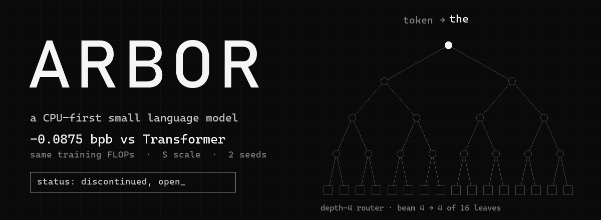
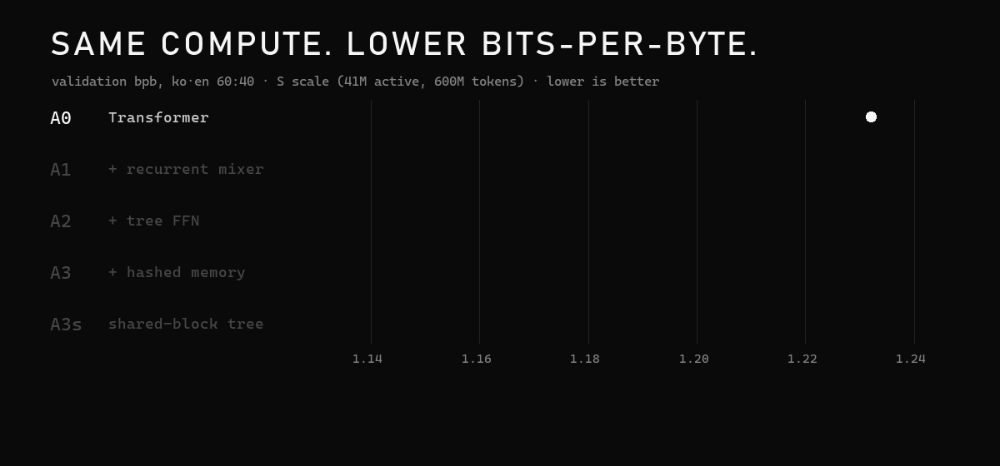
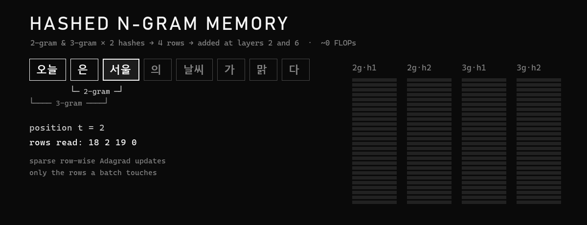

<div align="center">

<sub><b>English</b> &nbsp;|&nbsp; <a href="README.ko.md">한국어</a></sub>



<br>

<a href="#-results"></a>
<a href="#-results"></a>
<a href="#-status"></a>
<br>


<br><br>

### Small model. Same compute. Lower bits-per-byte.

At small scale — **41M active parameters, 600M training tokens, equal training FLOPs, 2 seeds** —<br>
Arbor beat a standard Transformer by **0.0875 bpb**, about **20×** the gap between seeds.

<br>

[**Results**](#-results) &nbsp;·&nbsp; [**How it works**](#-how-it-works) &nbsp;·&nbsp; [**Why CPU**](#-why-cpu-first) &nbsp;·&nbsp; [**Caveats**](#-read-this-before-you-trust-the-numbers) &nbsp;·&nbsp; [**Run it**](#-run-it) &nbsp;·&nbsp; [**Pick it up**](#-pick-it-up) &nbsp;·&nbsp; [**한국어**](README.ko.md)

</div>

<br>

## ■ Status

> [!IMPORTANT]
> **Discontinued — and handed over.** The architecture result is real but narrow: even if it holds at larger scale, a model with ~100M active parameters lands around GPT-2 small in language ability, which is too far from the original goal (a genuinely useful assistant that runs on CPU alone). Everything needed to continue is here: model code, data pipeline, tests, and a ready-to-run next experiment. MIT licensed.

<br>

## ■ At a glance

<table>
<tr>
<td align="center" width="33%"><h2>1.2320 → 1.1445</h2><sub>validation bpb<br>Transformer → Arbor</sub></td>
<td align="center" width="33%"><h2>−0.0875</h2><sub>bpb at equal training FLOPs<br>≈ 20× the seed-to-seed gap</sub></td>
<td align="center" width="33%"><h2>41M</h2><sub>active parameters<br>600M tokens per run</sub></td>
</tr>
<tr>
<td align="center"><h2>−0.006</h2><sub>replacing attention with a recurrent mixer<br>costs almost nothing in quality</sub></td>
<td align="center"><h2>−0.038 · −0.043</h2><sub>tree FFN · hashed n-gram memory<br>where the gain actually comes from</sub></td>
<td align="center"><h2>~8 h</h2><sub>total compute on one H100<br>data + pilots + 10 full runs</sub></td>
</tr>
</table>

<br>

## ■ Results

<div align="center">

</div>

<br>

Each Arbor component was added on top of a Transformer, one at a time. Same data windows, same learning-rate search budget, two seeds each.

| | Config | Seed 0 | Seed 1 | **Mean bpb** | Korean | English | Code | H100 tok/s |
|:-:|---|--:|--:|--:|--:|--:|--:|--:|
| ○ | **A0** Transformer | 1.2303 | 1.2336 | **1.2320** | 1.1898 | 1.2954 | 0.9723 | 417,961 |
| ◐ | **A1** + recurrent mixer | 1.2257 | 1.2260 | **1.2259** | 1.1825 | 1.2909 | 1.0698 | 382,176 |
| ◑ | **A2** + tree FFN | 1.1879 | 1.1873 | **1.1876** | 1.1416 | 1.2566 | 1.0371 | 300,463 |
| ● | **A3** + hashed memory | 1.1453 | 1.1437 | **1.1445** | 1.0952 | 1.2184 | 0.9978 | 182,468 |
| ◆ | **A3s** shared-block tree | 1.1461 | 1.1420 | **1.1441** | 1.0947 | 1.2181 | 0.9952 | 174,815 |

<sub>Validation bits-per-byte on held-out text, Korean·English weighted 60:40 (lower is better). Training FLOPs 1.49×10¹⁷ (A0–A2) and 1.53×10¹⁷ (A3/A3s, +2.7%).</sub>

- **Korean gains more than English** — −0.095 vs −0.077 from A0 to A3. The hashed memory alone gives Korean −0.046 and English −0.038. Why Korean benefits more is not known.
- **Code is the exception.** The Transformer is best on code (0.97). The recurrent mixer hurts it (1.07), and the hashed memory wins most of it back (1.00). Not investigated.
- **Mixer pilot:** Gated DeltaNet 1.8133 vs GLA 1.8374 at 100M tokens, so Gated DeltaNet was used throughout.
- **A3 vs A3s tie-break:** 0.0004 bpb apart (inside the pre-registered 0.01 tie zone), so CPU speed decided. With a Q8_0 AVX2 kernel at M size, A3s was faster in 3 of 3 runs (1.044× on average). **A3s is the "best Arbor".**

<br>

## ■ How it works

```mermaid
%%{init: {'theme':'base','themeVariables':{'primaryColor':'#0a0a0a','primaryTextColor':'#f5f5f5','primaryBorderColor':'#f5f5f5','lineColor':'#8a8a8a','secondaryColor':'#1c1c1c','tertiaryColor':'#141414','clusterBkg':'#111111','clusterBorder':'#5a5a5a','fontFamily':'ui-monospace, monospace'}}}%%
flowchart LR
    X([token ids]) --> E[embedding]
    E --> B
    subgraph B [" Arbor block · ×8 (S) / ×12 (M) "]
        direction LR
        N1[RMSNorm] --> MX["MIXER<br/>Gated DeltaNet heads ¾<br/>+ window-64 attention ¼"]
        MX --> P1((+))
        P1 --> H["HASHED MEMORY<br/>2/3-gram rows<br/>(layers 2 & 6)"]
        H --> N2[RMSNorm] --> TF["TREE FFN<br/>16 leaves of W/4<br/>beam 4 → width W"]
        TF --> P2((+))
    end
    B --> O["head<br/>full softmax (train)<br/>approx. vocab search (CPU)"]
    O --> Y([next token])
```



<table>
<tr>
<td width="33%" valign="top">

**◼ Recurrent mixer**

Same QKV and output projections as attention, so it costs the same FLOPs. ¾ of the heads are **Gated DeltaNet** (with a GLA alternative), and ¼ are softmax attention over the last **64 tokens**. Per-token cost stays flat no matter how long the context gets, so there is **no KV cache to grow**.

</td>
<td width="33%" valign="top">

**◼ Binary-tree FFN**

The SwiGLU FFN becomes **16 leaves of width W/4**. A depth-4 router with **beam 4** picks 4 leaves per token, so active width and FLOPs match a dense FFN while capacity is **4×**. Load-balance loss 0.01, router temperature 1.0 → 0.5. Training runs one padded batched matmul with no dropped tokens.

</td>
<td width="33%" valign="top">

**◼ Hashed n-gram memory**

2-grams and 3-grams are hashed twice each into **4 tables × 2²¹ rows × 256 dims (≈ 8.6 GB)**. Layers 2 and 6 share the tables, each with its own projection and gate. Rows are updated by **sparse row-wise Adagrad**, touching only the rows a batch uses. Lookups cost **~0 FLOPs**.

</td>
</tr>
</table>

<div align="center">

</div>

<details>
<summary><b>Model sizes</b></summary>

<br>

| Size | Layers / width | Heads (recurrent + window) | FFN W / leaf | Active params (Transformer / Arbor) | Arbor total (excl. hash) |
|---|---|---|---|---|---|
| S | 8 / 512 | 8 (6 + 2) | 1344 / 336 | 41.3M / 42.5M | 92.1M |
| M | 12 / 768 | 12 (9 + 3) | 2048 / 512 | 109.5M / 111.5M | 281.4M |

Vocabulary 32k with tied embeddings. Active parameters count the head once and 4 of 16 leaves; the hash table (2.15B parameters) is excluded because lookups cost almost no FLOPs.

</details>

<details>
<summary><b>Data & training recipe</b></summary>

<br>

| Source | Train tokens | Text | Bytes/token | Docs |
|---|--:|--:|--:|--:|
| Korean Wikipedia (2023-11) | 313.6M | 1.24 GB | 3.95 | 602,735 |
| Korean web — FineWeb-2 (kor_Hang) | 1,228.6M | 5.92 GB | 4.82 | 1,557,677 |
| English web — FineWeb-Edu (sample-10BT) | 962.1M | 3.94 GB | 4.09 | 827,037 |
| Python — The Stack (dedup) | 390.4M | 1.19 GB | 3.04 | 239,150 |

- **Mixture:** ko : en : code = 55 : 35 : 10.
- **Cleaning:** NFC; exact and MinHash/LSH near-duplicate removal (128 permutations, 5-word shingles, 16×8 bands); a document is dropped if it shares any **13-word n-gram** with a benchmark evaluation split (KoBEST, KMMLU, HAE-RAE, MMLU, HellaSwag, ARC-C) or with a document reserved for evaluation.
- **Tokenizer:** a 32k byte-level BPE trained from scratch, with every digit split into its own token. **No pretrained weights, vocabularies or embeddings anywhere.**
- **Optimization:** fused AdamW (0.9 / 0.95, wd 0.1), 1% warmup → cosine to 10%, clip 1.0, bf16, per-block `torch.compile`, chunked exact cross-entropy, 262k tokens per step.
- **Fairness:** training windows are a function of (seed, step) only, so every architecture sees the same data. Equal learning-rate search budget for both. All selection rules were written down before the results.
- **Metric:** every non-overlapping 2,048-token window of each held-out set, full softmax. bpb = nats / ln 2 / UTF-8 bytes.

</details>

<br>

## ■ Why CPU-first

On a CPU, generating a token is bound by **memory bandwidth**: every active weight is streamed from RAM once per token. Measured on a Ryzen 5 5600 with DDR4-2666:

```
STREAM-style triad (6 threads) ............ 17.8 GB/s
Q8_0 AVX2 matvec, weight read ............. 27–30 GB/s
dense 12L·d768 + 32k head, Q8 (123 MB) .... ≈ 234 tok/s   (weights only)
same kernel, 12 threads (SMT + barriers) .. 7 GB/s        → use 6 threads
```

Arbor's design goals follow from this: read fewer bytes per token (tree routing), have no KV cache that grows with context (recurrent mixer), and keep knowledge in a lookup table instead of in multiplications (hashed memory). The projected ceiling at 2K context is **≈ 290 tok/s for Arbor-M** vs **≈ 165 tok/s for a same-FLOP Transformer**. These are projections from kernel bandwidth; a full CPU runtime was never built.

<br>

## ■ Read this before you trust the numbers

<details open>
<summary><b>Five caveats</b></summary>

<br>

1. **The Transformer may be under-tuned.** Its best learning rate was the lowest one tried (1e-3), and lower kept helping. How much of the 0.0875 gap survives a wider sweep is unknown.
2. **Only one scale was run.** Small-scale wins often fail to transfer to larger models.
3. **FLOPs are matched; parameters are not.** Arbor has ~92M dense parameters plus ~2.1B in the hash table, versus 41M for the Transformer. The ladder never tests "Transformer + hashed memory" or "Transformer + tree/MoE FFN", so it cannot separate the architecture from the parameter count.
4. **The CPU-speed claim was never measured end to end.** The numbers above are kernel-level.
5. **One data mix, one metric (bpb).** At this size, downstream benchmarks would sit near chance anyway.

</details>

<details>
<summary><b>Engineering notes — things that cost time</b></summary>

<br>

- **Silent VRAM spill on WSL2.** Past 8 GB, the driver moved memory to system RAM without an error, and throughput dropped from ~24k to 931 tok/s. Capping the allocator turns this into a real OOM.
- **A `cumsum` over a size-4 dimension** took **42%** of the tree FFN's GPU time. With explicit adds, a padded batched matmul and gather-only dispatch, the tree FFN went from 3.6× to 2.3× the time of a dense FFN.
- **RTX 3050:** Arbor-M trained at 0.46× the Transformer's throughput at first, and **0.72×** after 8-bit AdamW, per-block compile and chunked CE.
- **H100:** the sparse Adagrad update runs on the CPU and became the bottleneck (S 0.44×, M 0.23×). A GPU-resident table is implemented and tested (same update rule) but was never used in a run.
- **Triton needs `Python.h`.** Without it, kernels fell back to the CPU with only a warning, so the preflight check now tests for it.
- **Resume is tested, not assumed.** A run is killed mid-way and restarted, and its final bpb must match an uninterrupted run (Transformer and Arbor, including hash-table state).

</details>

<br>

## ■ Run it

```bash
pip install -r requirements.txt          # Python 3.11+, torch 2.14.1, flash-linear-attention 0.5.2
python -m pytest -q tests/               # 23 tests: layer equivalences, data, leakage, resume

# R1 — data + S ladder   (HF token whose account accepted bigcode/the-stack-dedup terms)
HF_TOKEN=... python3 run_server.py

# R2 — learning-rate fix + M comparison   (same machine, after R1; prepared, never run)
python3 run_server.py --config configs/server_r2.yaml
```

`run_server.py` installs the requirements and runs a few-minute **preflight** check (GPU, Triton kernels, `torch.compile`, disk, RAM, dataset access, the full test suite). It stops on any failure; otherwise it launches the pipeline in the background. Every stage writes a completion marker, so the same command resumes where it left off. The Python development headers (`python3.x-dev`) must be installed.

```
arbor/
├─ layers/   mixer.py · treeffn.py · hashmem.py
├─ models/   lm.py ─ one class builds A0 · A1 · A2 · A3 · A3s
├─ data/     fetch · clean (dedup + 13-gram leakage) · bpe · memmap
├─ train/    pretrain.py (resume, val bpb) · r1.py (S ladder) · r2.py (M comparison)
└─ bench/    STREAM · Q8_0 AVX2 matvec · tree layout · GPU
configs/     server_r1 · server_r2 · smoke_*
scripts/     preflight.py
tests/       23 tests
run_server.py
```

<br>

## ■ Pick it up

- [ ] **Run R2.** Widen the learning-rate grid with equal budget (Transformer {5e-4, 2.5e-4}, Arbor {1.5e-3, 3e-3}), search the M learning rate over {⅓, ½, ⅔, 1}× the S optimum, train A0-M and A3s-M on 2B tokens, and add a seed if the gap is under 0.03 bpb. Estimated at 10–17 h on one H100 with the hash table on the GPU.
- [ ] **Add the missing baselines:** Transformer + the same hashed memory, and Transformer + tree FFN (or a standard top-k MoE). A few H100 hours at S.
- [ ] **Build the CPU runtime** (C++17, AVX2, Q8_0, recurrent state, tree routing, mmap'd hash table, approximate vocab search), then compare tok/s, first-token latency and peak RAM at equal bpb. Also measure the bpb cost of an int8 or fp16 hash table.
- [ ] **Find out why the recurrent mixer hurts code:** wider window, more attention heads, or a copy mechanism.
- [ ] **Check novelty** against Fast Feedforward Networks, Memory Layers at Scale, Gated DeltaNet, Griffin and Samba. The likely contribution is an equal-FLOP decomposition aimed at CPU inference, not a new component.

> [!NOTE]
> The assistant half of the original plan was never built: a document retrieval graph, persistent memory, tools, a check that every number in an answer has a source, and switchable nightly LoRA learning.

<br>

## ■ License

MIT — see [`LICENSE`](LICENSE). Each training dataset has its own license and terms; check them before reusing data or weights.

<br>

<div align="center">
<sub><code>ARBOR</code> &nbsp;·&nbsp; small model, same compute, lower bpb &nbsp;·&nbsp; discontinued, open for whoever picks it up</sub>
</div>
